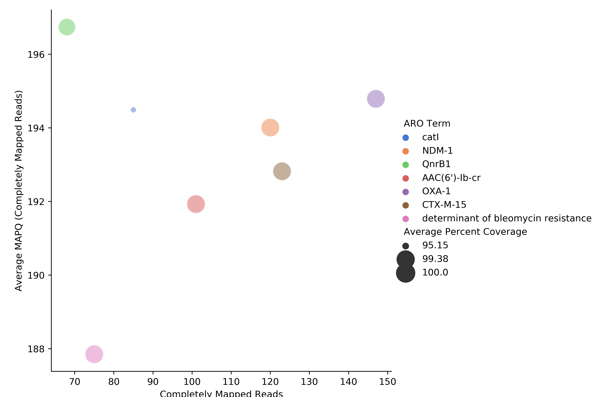
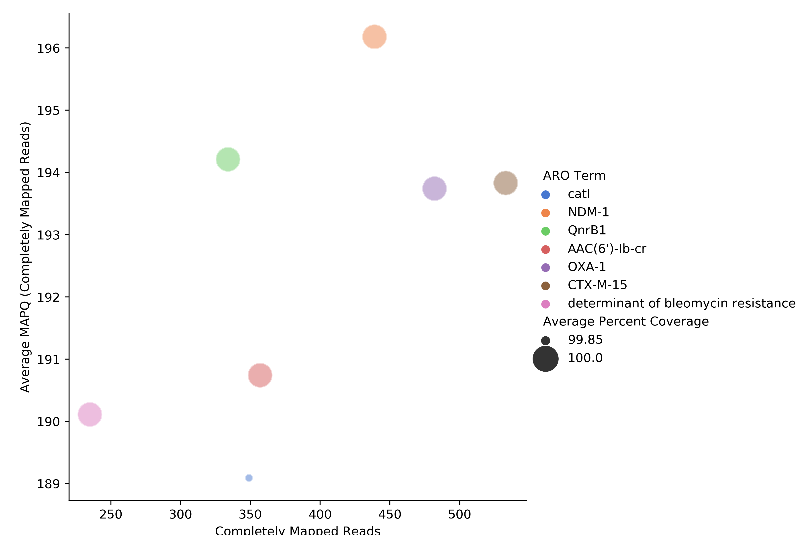
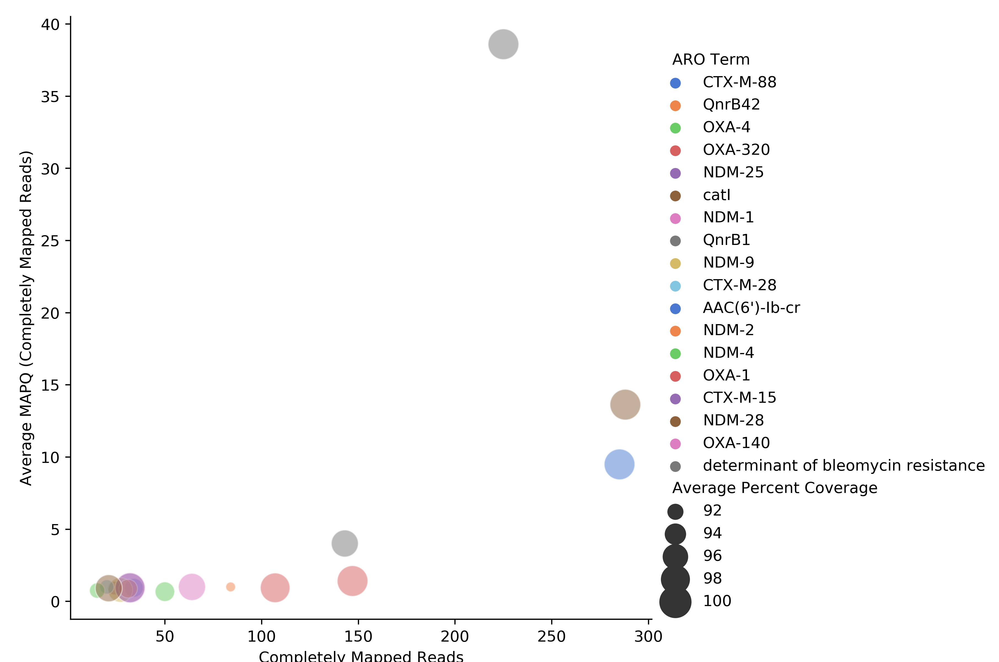

# read-mapping-analysis

This software is used to simulate reads for an annotated genome, use CARD's (card.mcmaster.ca) `RGI BWT` with either `kma` or `bowtie2` and evaluate read mapping.

# Required software

- RGI BWT (https://github.com/arpcard/rgi)
- CARD data (https://card.mcmaster.ca/download)
- ART_Illumina (https://www.niehs.nih.gov/research/resources/software/biostatistics/art/index.cfm)
- seaborn

# kma vs bowtie2

I compared aligner `kma` and `bowtie2` for simulated reads from a complete plasmid genome (JN420336.1). The reads were simulated at multiple depths i.e 10x, 20x, 30x, 40x etc using `ART_Illumina`. The AMR genes annotated for this genome (JN420336.1) are show in the table below:

| Gene          | Strand    | Start     | Stop      |
| :--------     | :-------: | :-------: | :-------:  |
| catB3         | -         |  821      |  1262     |
| OXA-1         | -         |  1400     |  2230     |
| AAC(6’)-Ib    | -         |  2361     |  2960     |
| NDM-1         | +         |  9726     |  105538   |
| bleMBL        | +         |  10542    |  10907    |
| QnrB1         | +         |  18456    |  19100    |
| CTX-M-15      | +         |  263730   |  264605   |

# simulate paired-end reads using `art_illumina`, example:

`art_illumina -ss HS25 -sam -i data/JN420336.1.fasta --paired --len 150 --fcov 20 --mflen 200 --sdev 10 --out JN420336_20x`

```
art_illumina -ss HS25 -sam -i data/JN420336.1.fasta --paired --len 150 --fcov 20 --mflen 200 --sdev 10 --out JN420336_20x

    ====================ART====================
             ART_Illumina (2008-2016)          
          Q Version 2.5.8 (June 6, 2016)       
     Contact: Weichun Huang <whduke@gmail.com> 
    -------------------------------------------

                  Paired-end sequencing simulation

Total CPU time used: 5.59978

The random seed for the run: 1699922318

Parameters used during run
	Read Length:	150
	Genome masking 'N' cutoff frequency: 	1 in 150
	Fold Coverage:            20X
	Mean Fragment Length:     200
	Standard Deviation:       10
	Profile Type:             Combined
	ID Tag:                   

Quality Profile(s)
	First Read:   HiSeq 2500 Length 150 R1 (built-in profile) 
	First Read:   HiSeq 2500 Length 150 R2 (built-in profile) 

Output files

  FASTQ Sequence Files:
	 the 1st reads: JN420336_20x1.fq
	 the 2nd reads: JN420336_20x2.fq

  ALN Alignment Files:
	 the 1st reads: JN420336_20x1.aln
	 the 2nd reads: JN420336_20x2.aln

  SAM Alignment File:
	JN420336_20x.sam

```

# Use the generated reads to run `RGI bwt`

```
rgi bwt -1 JN420336_20x1.fq -2 JN420336_20x2.fq -o JN420336_20x -a kma -n 20 --local --clean --debug > run.log 2>&1 &
```

# The plots are generated using a custom script `scatter_plot_one.py` as shown in the example below:

```
python3 scripts/scatter_plot_one.py -h
usage: scatter_plot [-h] [-i INPUT_FILE] [-o OUTPUT_FILE] [-n READS_COUNT] [-c COVERAGE] [-q MAPQ] [--one_family ONE_FAMILY] [-p {aro_term,amr_gene_family,specific_amr_gene_family}]

scatter plot

optional arguments:
  -h, --help            show this help message and exit
  -i INPUT_FILE, --input_file INPUT_FILE
                        tab input file
  -o OUTPUT_FILE, --output_file OUTPUT_FILE
                        png output file
  -n READS_COUNT, --reads_count READS_COUNT
                        filter by reads count
  -c COVERAGE, --coverage COVERAGE
                        filter by coverage
  -q MAPQ, --mapq MAPQ  filter by mapq
  --one_family ONE_FAMILY
                        filter by one amr gene family e.g 'NDM beta-lactamase'
  -p {aro_term,amr_gene_family,specific_amr_gene_family}, --plot {aro_term,amr_gene_family,specific_amr_gene_family}
                        specify a category (default = aro_term)
```

# Example generating a scatter plot for RGI BWT output (reads simulated at 20x, using KMA aligner)

`python3 scripts/scatter_plot_one.py -q 100 -i JN420336_20x.output.gene_mapping_data.txt -o 20`

# Output will be named `20.png`



# KMA vs Bowtie2 at 80x

## KMA at 80x



## Bowtie2 at 80x




## License

The source code is licensed under the MIT license, which you can find in
the LICENSE file.